

# 🔐 Mediroza General Hospital Penetration Testing

### Black-Box Security Assessment

**Networkwalks Cybersecurity Internship — Batch B083 | Week 4**

 

---

## 📋 Project Overview

This project presents a **black-box web application penetration test** conducted against the authorized **Mediroza General Hospital** training environment as part of the **Networkwalks Cybersecurity Internship — Batch B083, Week 4**.

The assessment focused on identifying security vulnerabilities within the target web application, demonstrating their impact through controlled exploitation, analyzing exposed information, and documenting the findings using a professional penetration testing methodology.

### 🎯 Engagement Information

| **Parameter**       | **Details**                                |
| ------------------- | ------------------------------------------ |
| **Client**          | Mediroza General Hospital                  |
| **Target**          | `https://medirozahospital.com`             |
| **Assessment Type** | Black-Box Web Application Penetration Test |
| **Engagement**      | Networkwalks Cybersecurity Internship      |
| **Batch**           | B083                                       |
| **Week**            | Week 4                                     |
| **Duration**        | 5 Days                                     |
| **Testing Scope**   | Authorized Target Domain Only              |

---

## 🎯 Project Objectives

The engagement was divided into four milestones:

| Milestone | Objective                                                                          | Status      |
| --------- | ---------------------------------------------------------------------------------- | ----------- |
| **M1**    | Gain access to the restricted area and retrieve 3 confidential patient PDF reports | ✅ Completed |
| **M2**    | Recover the contents of all 3 encrypted PDF reports                                | ✅ Completed |
| **M3**    | Identify exposed employee salary and shareholder information                       | ✅ Completed |
| **M4**    | Document the assessment in a professional penetration testing report               | ✅ Completed |

---

## 🛠️ Tools & Technologies

| Category              | Tools                                          |
| --------------------- | ---------------------------------------------- |
| Reconnaissance        | WHOIS, NSLookup, WhatWeb, WAFW00F, DNSRecon    |
| Web Analysis          | Browser, Developer Tools, Source Code Analysis |
| Web Exploitation      | SQL Injection Testing                          |
| File Analysis         | PDF Analysis & Password Recovery Tools         |
| Information Discovery | `robots.txt`, Directory Listing Analysis       |
| Evidence Collection   | Screenshots, Retrieved Files, Command Output   |
| Environment           | Kali Linux                                     |

---

# 🔎 M1 — Initial Access

The first milestone focused on reconnaissance, identifying the application's attack surface, analyzing the authentication mechanism, and testing the login functionality.

### Reconnaissance

The following reconnaissance techniques were performed against the authorized target:

* WHOIS information gathering
* DNS enumeration
* NSLookup analysis
* Technology fingerprinting
* WAF detection
* DNS record enumeration

### Reconnaissance Evidence

#### WHOIS
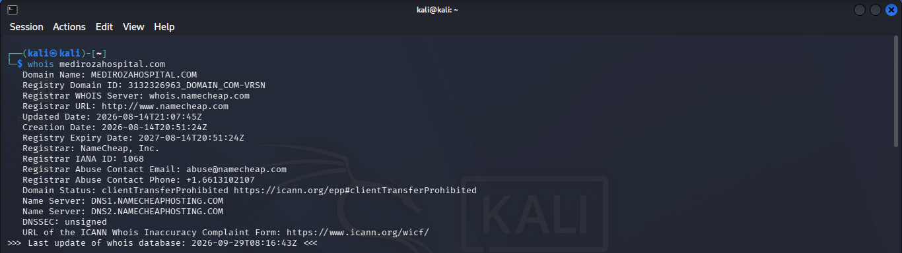

#### NSLookup
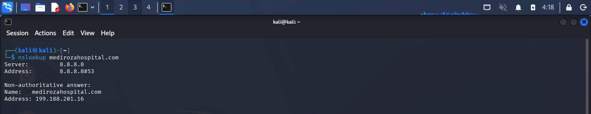

#### WhatWeb
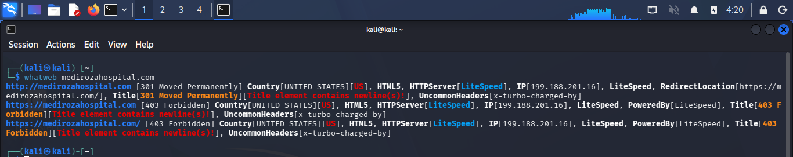

#### WAFW00F
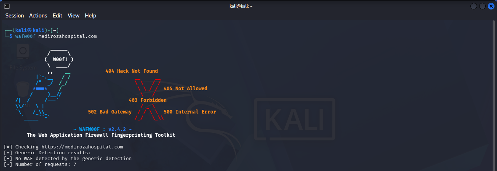

#### DNSRecon
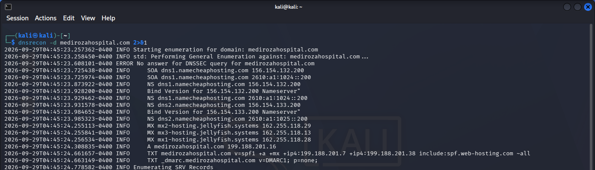

---

## 🔐 Login Analysis

After reconnaissance, the application's authentication functionality was examined.

The login page and its source code were reviewed to understand how user input was processed and how authentication was implemented.

### Login Source Code
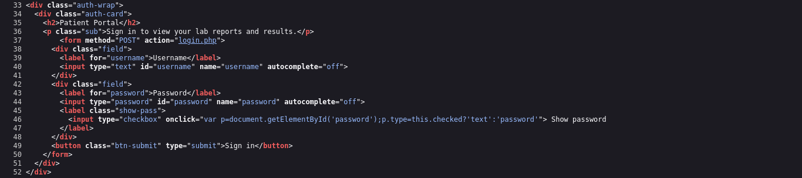

Further testing identified an SQL injection vulnerability in the authentication mechanism.

### SQL Injection Testing
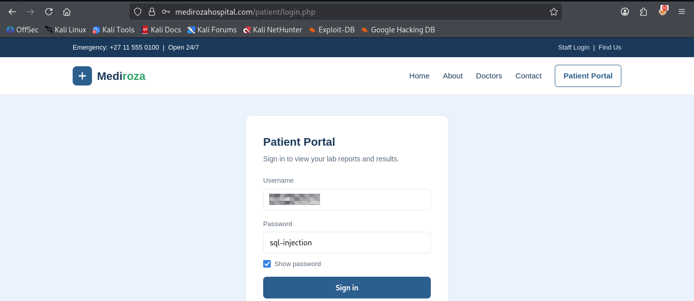

> **Note:** Sensitive exploitation payloads and credentials should not be published in a public repository unless explicitly permitted by the project owner.

### Restricted Area Access

Successful exploitation resulted in access to the restricted area containing patient laboratory reports.
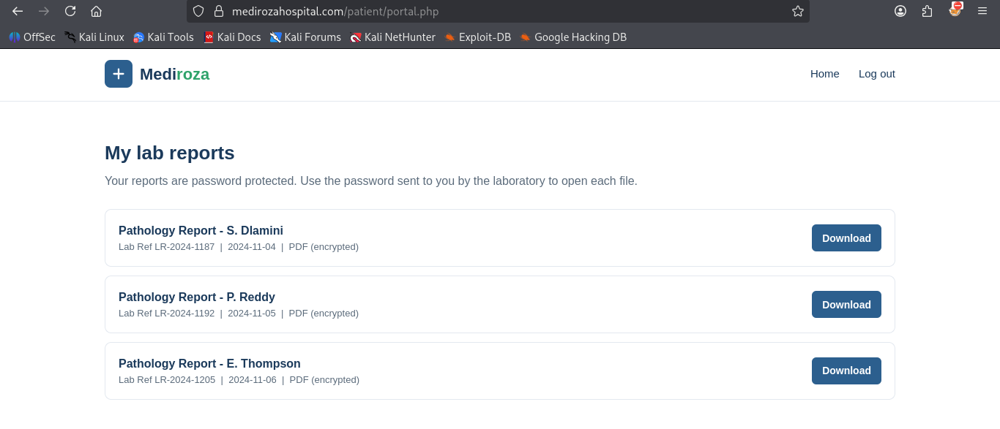

### M1 Result

**Milestone 1 completed:** Three confidential patient PDF laboratory reports were identified and retrieved for further analysis.

---

# 🔓 M2 — PDF Password Recovery

The three retrieved patient reports were protected with PDF encryption/password protection.

The files were analyzed individually and appropriate password recovery techniques were applied.

## Patient Report 1
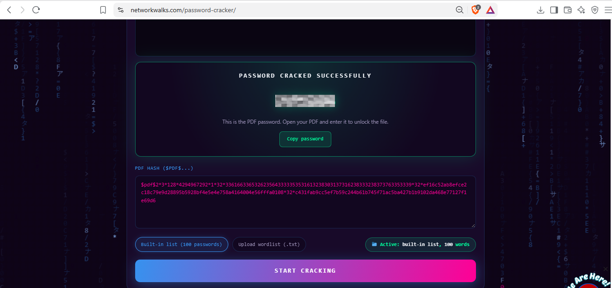

## Patient Report 2

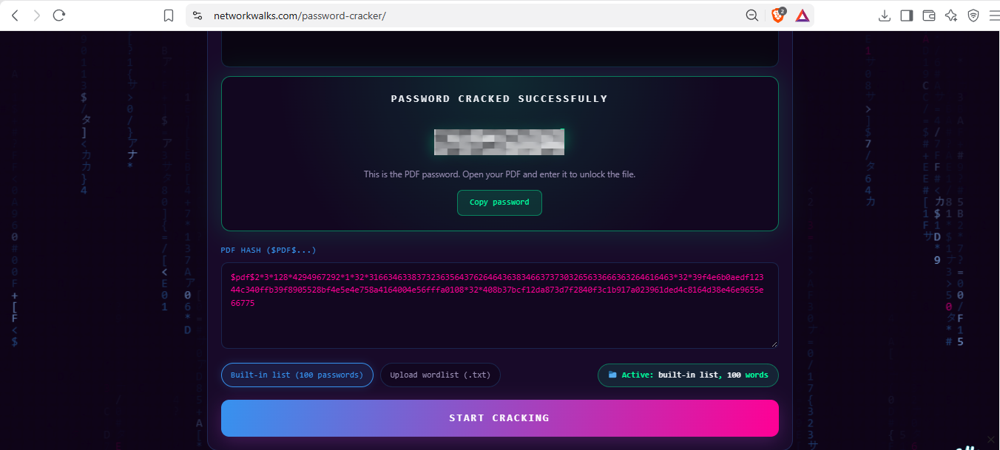

## Patient Report 3

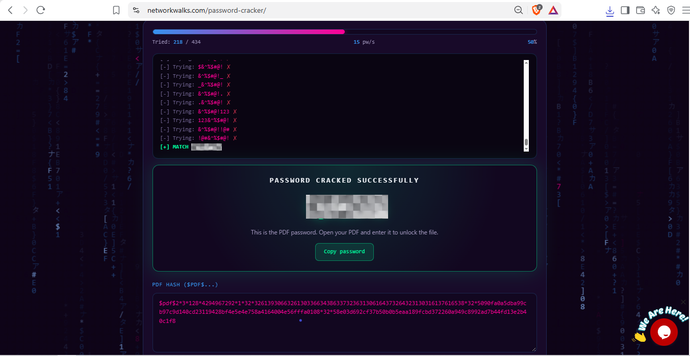

### M2 Result

**Milestone 2 completed:** Password recovery was successfully performed against all three encrypted patient reports, allowing their contents to be analyzed.

---

# 🗂️ M3 — Critical Data Exposure

The third milestone focused on analyzing information discovered during the assessment and identifying additional sensitive information exposed by the application.

The investigation included:

* `robots.txt` analysis
* Hidden directory discovery
* Directory listing analysis
* Backup file identification
* Database backup analysis
* Sensitive information exposure analysis

---

## robots.txt Analysis

The site's `robots.txt` file was examined for references to directories and resources that were not intended for normal indexing.

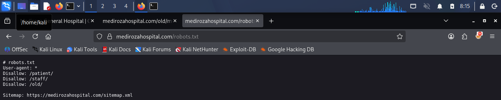

---

## Old Directory Discovery

Further investigation identified an old directory containing additional resources.

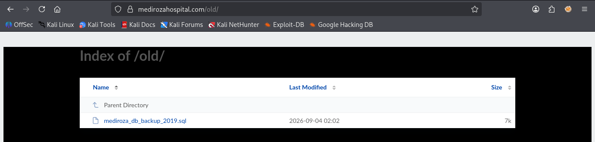

---

## Database Backup Exposure

A database backup was identified during the investigation.

The exposed backup was analyzed to determine whether it contained sensitive information belonging to the hospital.

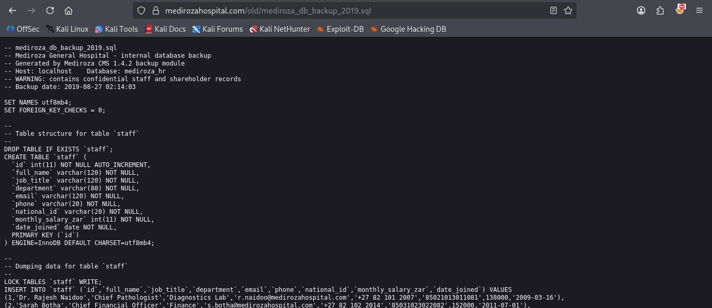

The analysis revealed sensitive organizational information, including:

* Employee salary information
* Employee-related confidential records
* Hospital shareholder information

Sensitive personal information should **not be reproduced in this public repository**. Only the minimum evidence required to demonstrate the vulnerability should be retained.

### M3 Result

**Milestone 3 completed:** A critical information exposure was identified through the publicly accessible database backup, demonstrating a significant confidentiality risk.

---

# 📊 Findings Summary

| ID   | Finding                                        | Severity |
| ---- | ---------------------------------------------- | -------- |
| F-01 | SQL Injection in Authentication                | Critical |
| F-02 | Exposed Database Backup                        | Critical |
| F-03 | Weak Password Protection on Patient PDFs       | High     |
| F-04 | Directory Listing / Information Exposure       | Medium   |
| F-05 | Sensitive Path Disclosure through `robots.txt` | Low      |

> Severity ratings should be finalized according to the evidence collected during the assessment and the methodology required by the instructor/client.

---

# 🛡️ Recommendations

### 1. Prevent SQL Injection

* Use parameterized queries / prepared statements.
* Never concatenate user-controlled input directly into SQL queries.
* Implement server-side input validation.
* Use least-privilege database accounts.

### 2. Protect Database Backups

* Remove database backups from the public web root.
* Store backups outside the web-accessible directory.
* Restrict backup access using appropriate permissions.
* Encrypt sensitive backups at rest.
* Regularly scan the web server for accidentally exposed backup files.

### 3. Improve PDF Password Security

* Use long and unpredictable passwords/passphrases.
* Avoid passwords based on names, dates, keyboard patterns, or common words.
* Apply appropriate encryption standards to sensitive documents.
* Implement secure document access controls.

### 4. Disable Unnecessary Directory Listing

* Disable directory indexing on the web server.
* Remove obsolete directories and files.
* Review publicly accessible resources regularly.

### 5. Review Information Disclosure

* Avoid exposing sensitive paths through publicly accessible files.
* Review `robots.txt` entries carefully.
* Do not rely on `robots.txt` to protect confidential resources.

---

# 📚 Skills Demonstrated

* Web Application Reconnaissance
* DNS Enumeration
* Technology Fingerprinting
* WAF Detection
* Web Application Security Testing
* Authentication Security Testing
* SQL Injection Identification
* Vulnerability Exploitation
* PDF Security Analysis
* Password Recovery
* Directory Enumeration
* Sensitive Data Exposure Analysis
* Database Backup Analysis
* Evidence Collection
* Risk Assessment
* Penetration Testing Documentation

---

# 📝 Conclusion

This project provided practical experience in conducting a black-box web application penetration test from reconnaissance through exploitation and post-exploitation analysis.

The assessment demonstrated how weaknesses in authentication, file exposure, directory configuration, and document protection can contribute to unauthorized access and sensitive information disclosure.

The project also reinforced the importance of secure coding practices, proper access controls, secure backup management, strong password policies, and continuous security testing.

---

## ⚠️ Responsible Disclosure

This repository is intended for **educational and portfolio purposes**.

Sensitive patient information, credentials, passwords, exploitation payloads, and confidential organizational data should not be published publicly. Where applicable, evidence should be redacted before sharing.

All security testing described in this project was performed against an authorized training environment.

---

## 👤 Author

**Pritesh Kalsariya**
Cybersecurity Professional — B083

**LinkedIn:** [www.linkedin.com/in/pritesh-kalsariya-4529a833b](https://www.linkedin.com/in/pritesh-kalsariya-4529a833b)

---

## 📌 Project Information

**Program Name:** Cybersecurity Program at Networkwalks | **Week:** 04 | **Modules:** Penetration Testing Report | **Repository** GitHub |
